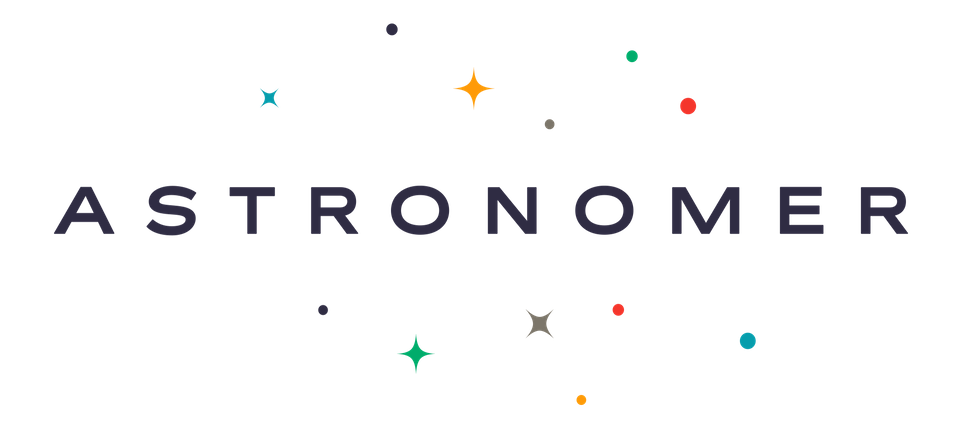

# Meteor Package for [Astronomer](http://astronomer.io)

Astronomer's Meteor package is designed to instrument your entire Meteor app for user analytics.  

#####*NOTE: If you are using the package "percolatestudio:segment.io," you will need to remove this before installing Astronomer. This package sets a global 'analytics' object that makes things a bit, uh, wonky.*

###Which user actions get tracked?
All of them! This is done by tracking all Meteor methods, route changes (flow-router and iron-router), and insertions into minimongo.

# 1. Add the package

Open your terminal, change your directory to your app, and add the Astronomer package:

```meteor add astronomerio:core```

# 2. Create an Astronomer app & Copy your App ID

Visit [app.astronomer.io](https://app.astronomer.io) to sign up!


For those of you using Astronomer for the first time, create your first app!  Current users, hit the "+" symbol at the top right of the screen to create a new app, or use any existing app.


Now that you have an app created, switch over to that app's Settings tab and copy your App ID.


# 3.  Configure your Meteor application

1. Copy the snippet below
2. Create a new file called `settings.json` at the root directory of your Meteor application and paste this snippet inside that file.  If you already have a file named `settings.json`, simply add this snippet to it.
3. Paste your Astronomer App ID into the second half of the `"appID": "XXXXXXXXXXXXXXXXXXX"` field, replacing the X's.
4. Restart your Meteor application.

```
{
  "public": {
    "astronomer": {
      "appId": "XXXXXXXXXXXXXXXXXXX",
      "disableUserTracking": true,
      "disableRouteTracking": true,
      "disableMethodTracking": true
    }
  }
}
```

`disableUserTracking`: `true` or `false`, optional.  This tracks aliased users.  Note: if you don't have [anonymous users aliased inside Meteor](http://docs.meteor.com/api/accounts.html) yet, we recommend doing that so you receive meaningful user information.  

`disableRouteTracking`: `true` or `false`, optional.  This sends a Page call as routing is engaged within your Meteor App.

`disableMethodTracking`: `true` or `false`, optional.  This sends a Track call as methods are engaged within your Meteor App.

# 4. Run your Meteor app & see events!

Now that you have a settings.json, you'll have to tell Meteor to run with this configuration.  Either manually run your app by calling `meteor --settings settings.json` or adding that run command to any existing run configuration inside your app's `package.json`.

With your Meteor app fired up (local or hosted), switch between pages (routing) and engage known methods inside your application.  You should see corresponding events in your Astronomer app's Live Stream!


# 5. Customize your analytics tracking with Astronomer

You're not limited to what we have baked in (which is a lot!).  You can track anything triggered inside your Meteor app!  Lets just say you want to trigger a tracked event when a user upvotes your hot new blog post.  Inside your app where that event is captured, simply

```
analytics.track('Upvoted my hot new blog post', {
  name: 'Why Captain Kathryn Janeway is the best Star Trek captain EVER!',
  quantity: 1
});
```
and you'll see that event tracked inside your Live Events.  Boom!

And you know what's even **more awesome**?!  You're ready to configure any of the integrations you see available in our platform (including an integration option to send your Astronomer app's Live Events to Amazon Redshift)!  Be sure to check out [our docs](http://docs.astronomer.io/docs) to get started (each integration has different setup instructions).


# 6. Share your story with us (not optional!)

Please reach out with any feedback of any kind through the Astronomer app itself (bottom right icon).  We can't wait to hear from you!

